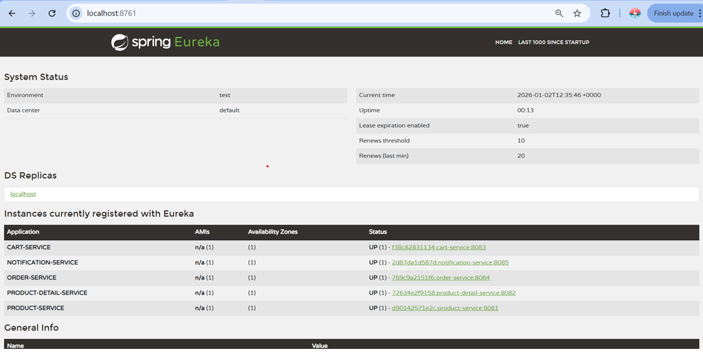
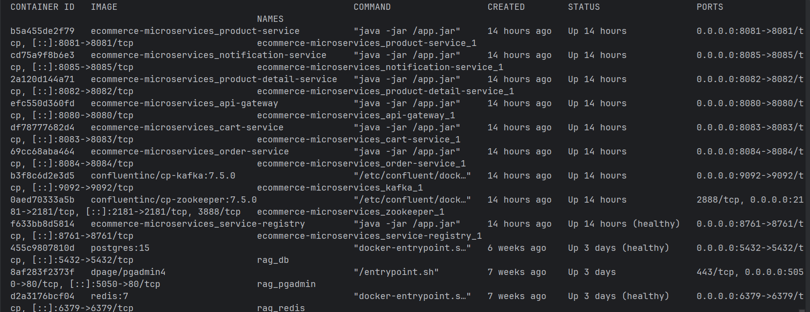
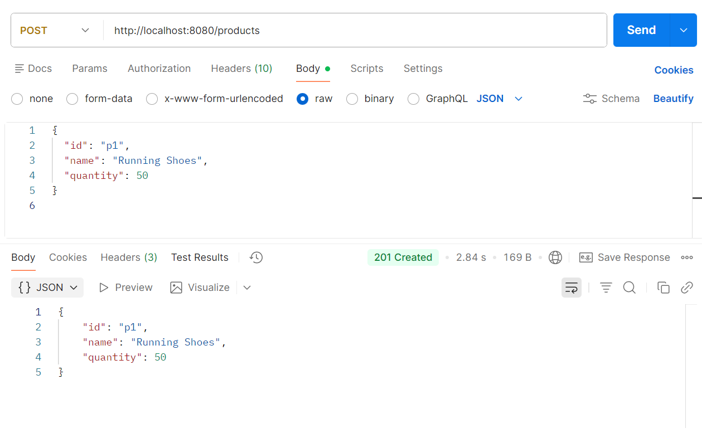
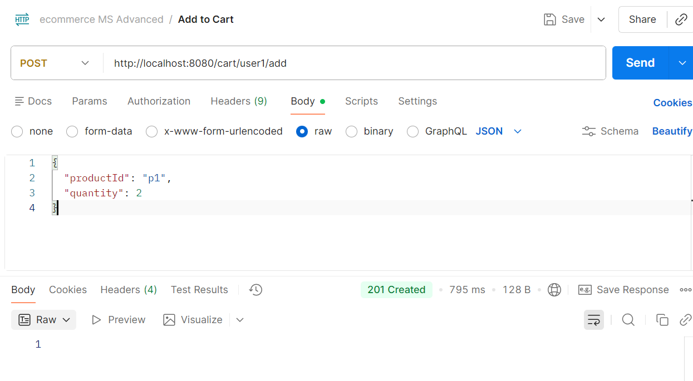
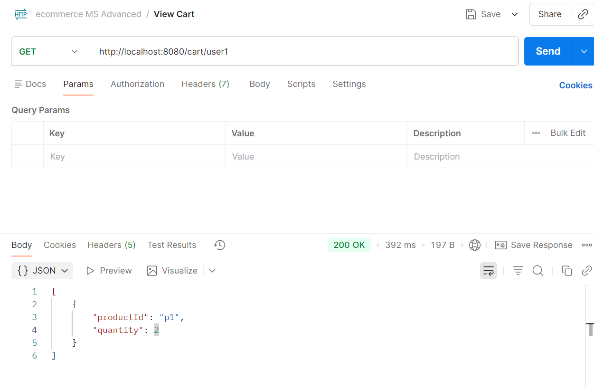
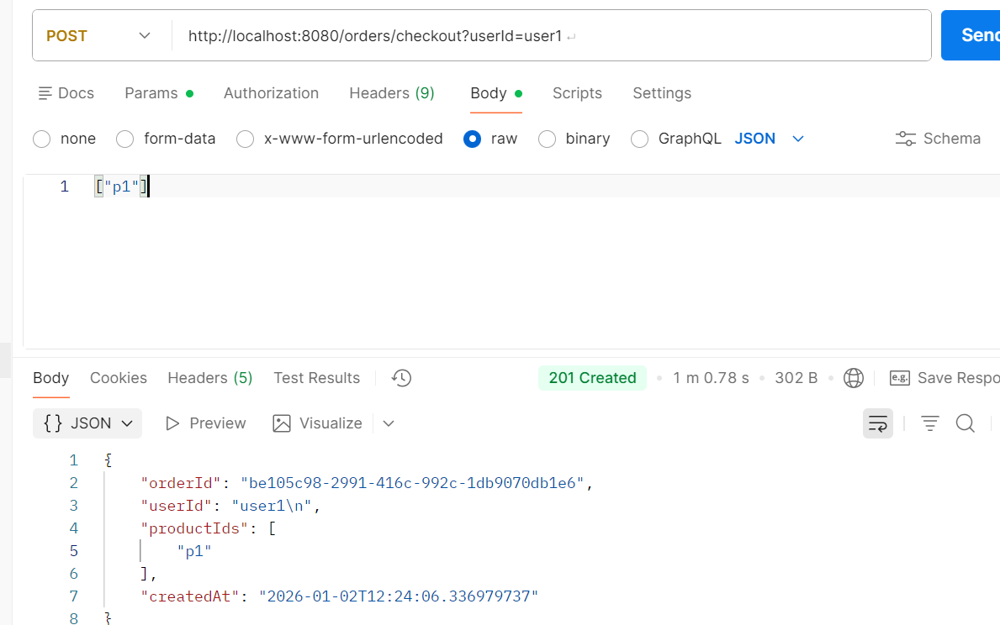

# Ecommerce Microservices Assignment – Final Submission

---

## 1. Overview

This project implements a backend system for an e-commerce application using **Microservices Architecture**. The system is containerized using Docker and demonstrates synchronous and asynchronous communication, service discovery, API Gateway, logging, exception handling, scalability considerations, and security basics.

---

## 2. Identified Microservices & Responsibilities

### 2.1 Product Service

* Manage product inventory (add, remove, list products)
* Exposes REST APIs for users and admin
* In-memory data store (HashMap)

### 2.2 Product Detail Service

* Manages product attributes like price, size, design
* Queried synchronously by Product Service
* Demonstrates inter-service REST communication

### 2.3 Cart Service

* Add products to cart
* View cart per user
* In-memory storage per user

### 2.4 Order Service

* Checkout functionality
* Creates order and publishes `ORDER_CREATED` event to Kafka
* Core business flow (synchronous)

### 2.5 Notification Service

* Consumes Kafka events asynchronously
* Logs notifications to console

### 2.6 API Gateway

* Single entry point for all clients
* Routes requests to downstream services

### 2.7 Service Registry (Eureka)

* Service discovery
* Dynamic registration of services

---

## 3. High Level Architecture (HLD)

**Flow:**

Client → API Gateway → Microservices → Kafka → Notification Service

* API Gateway performs routing
* Eureka enables service discovery
* Kafka enables asynchronous event-driven communication

---

## 4. Communication Patterns

| Interaction              | Type                 |
| ------------------------ | -------------------- |
| Product ↔ Product Detail | Synchronous (REST)   |
| Order → Notification     | Asynchronous (Kafka) |
| Client → Services        | Synchronous (REST)   |

---

## 5. Cross-Cutting Concerns

### 5.1 Logging & Tracing

* SLF4J + Logback
* Correlation via logs

### 5.2 Exception Handling

* Centralized try/catch
* Kafka failures handled gracefully

### 5.3 Scalability

* Stateless services → horizontal scaling
* Kafka enables async scaling
* API Gateway load balancing

### 5.4 Security

* API Gateway as security choke point
* JWT / OAuth2 can be added
* HTTPS termination at gateway

---

## 6. Docker & Containerization

Each service has its own Dockerfile.

### Docker Compose Includes:

* Eureka Server
* API Gateway
* All Microservices
* Kafka
* Zookeeper

---

## 7. How to Build & Run

### Step 1: Build all services

```bash
mvn clean package -DskipTests
```

### Step 2: Run using Docker

```bash
docker-compose up --build
```

### Step 3: Verify

* Eureka: [http://localhost:8761](http://localhost:8761)
* Gateway: [http://localhost:8080](http://localhost:8080)

---

## 8. API Testing (Postman)

### Add Product

POST /products

```json
{"id":"p1","name":"Shoes","quantity":10}
```

### View Products

GET /products

### Add to Cart

POST /cart/user1/add

```json
{"productId":"p1","quantity":1}
```

### Checkout

POST /orders/checkout?userId=user1

```json
["p1"]
```

---

## 9. CI/CD Pipeline (Conceptual)

1. Code Commit (GitHub)
2. Build (Maven)
3. Unit Tests
4. Docker Image Build
5. Push to Docker Registry
6. Deploy via Docker Compose / Kubernetes

---

## 10. 📸 Screenshots

### 🔹 Service Discovery – Eureka Dashboard
Shows all registered microservices including API Gateway.



---

### 🔹 Dockerized Deployment – Running Containers

Displays all microservices, Kafka, Zookeeper, and supporting services running using Docker Compose.



---

### 🔹 Product Service – Add New Product (Postman)
Admin adding a new product to the inventory.



---

### 🔹 Product Service – View Products (Postman)
Admin/User fetching product list.


---

### 🔹 Cart Service – Add to Cart

User adding a product to the cart.



---

### 🔹 Cart Service – View Cart

User viewing cart details before checkout.



---

### 🔹 Order Checkout Flow
User checkout triggering order creation.



---
---

## 11. Assumptions

* In-memory data used instead of database
* Single Kafka broker
* No UI required

---

## 12. Conclusion

This project demonstrates a real-world microservices-based backend with proper separation of concerns, fault tolerance, async messaging, and containerized deployment. The design is extendable for future enhancements like database integration, authentication, and Kubernetes deployment.

---

**Author:** Sakshi Sehgal
